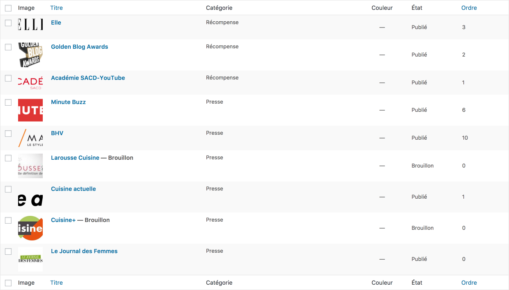

# Link CPT 🔗

> The plugin doesn't bring any kind of front end assets (like JS, shortcode, CSS), you have to do your request on your own.

__Link__ is a __WordPress__ plugin for create __Link__ custom post type and a custom category associate to __Link__. __Link__ CPT is like good old blogroll. Blogroll isn't supported anymore in __WordPress__, it's in source code but only for backward compatibility purpose.

## Feature

A __Link__ can have: 

- an URL, save as `link_url` in _post_meta_,

- a color, save as `link_color` in _post_meta_,

- a description, save `link_description` in _post_meta_,

- For image the custom post type used the built in thumbnail functionality.

- The link plugin offers the possibility to order links in backoffice. Thanks to menu_order.

__WordPress__, since [3.5](https://make.wordpress.org/core/2012/11/30/new-color-picker-in-wp-3-5/) version, ship in its core a [color picker](https://github.com/automattic/Iris).

## TODO

- [ ] Create a shortcode